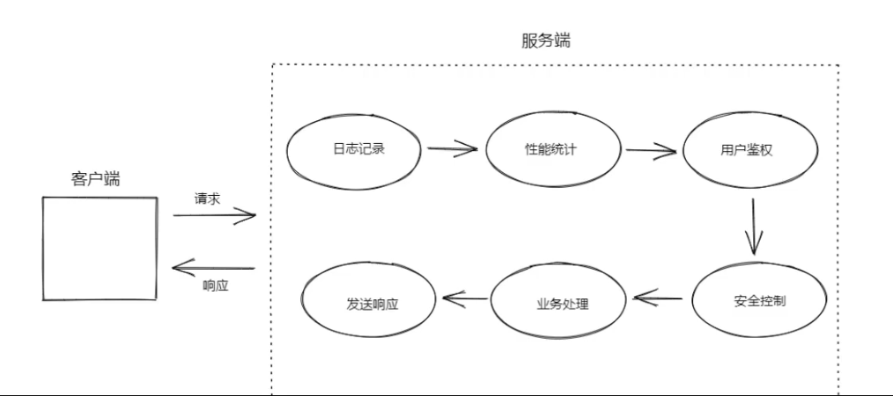
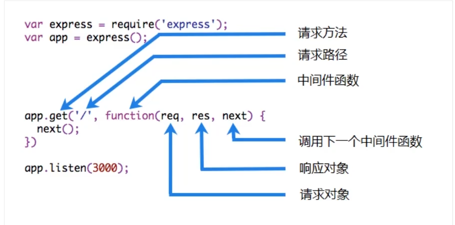

# Express

## Express是什么

### Express是一个快速，简单，极简的Node.js web开发应用框架，通过它，可以轻松的创建各种web应用。例如

* 接口服务
* 传统的web网站
* 开发工具集成的
* ...

### Express本身是极简的，仅仅提供了web开发的基础功能，但是它通过中间件的方式集成了许许多多的外部插件来处理http请求

* body-parser：解析HTTP请求体
* compression：压缩HTTP响应
* cookie-parser：解析cookie数据
* cors：处理跨域资源请求
* morgan：HTTP请求日志记录
* ...

### Express中间件固然强大，但是它所提供的灵活性是一把双刃剑

### 它让Express本身变得灵活和简单

### 缺点在于虽然一些中间件包可以解决几乎所有的问题和需求，但是挑选合适的包时也会成为一个挑战

### Express不对Node.js已有的特性进行二次抽象，只是在它之上扩展了web应用所需的基本功能

* 内部使用还是http模块
* 请求对象继承自http.IncomingMessage
* 响应对象继承自http.SeverResponse
* ...

### 有很多流行框架基于Express

* LoopBack：高度可扩展开源的Node.js框架，用于快速创建动态的端到端RESTAPI
* Sails：用于Node.js的MVC框架，用于构建实用的，可用于生产的应用程序
* NestJs：一个渐进式的Node.js框架，用于在TypeScript和JavaScript（ES6,ES7,ES8）之上构建按搞笑，可扩展的企业级服务器端应用
* ...

### Express开发zuozhe TJ

* Express，commander，ejs，co，koa...

## Express 特性

* 简单易学
* 丰富的API支持，以及常见的HTTP辅助程序，例如重定向，缓存等
* 强大的路由功能
* 灵活的中间件
* 高性能
* 非常稳定（源代码几乎100%覆盖率）
* 视图系统支持14个以上的主流模板引擎
* ...

## Express发展史

* ...

## Express

* 传统的Web网站
* 接口服务
* 服务器端渲染中间层
* 开发工具
* ...

## 路由基础

路由是指确定应用程序如何响应客户端对指定端点的请求，该特定端点是URI（或路径）和特定的HTTP请求方法（GET,POST等）。

每个路由可以具有一个或多个处理程序函数，这些函数在匹配该路由时执行。路由定义采用以下节后：

`app.METHOD(PATH,HANDLER)`

* app是Express实例
* METHOD是小写的HTTP请求方法
* PATH是服务器上的路径
* HANDER是当路由匹配时执行的功能

下面是一些简单示例：

在根路径响应Hello World：

~~~javascript
app.get('/',(req,res)=>{
  res.send('Hello World');
})
~~~

在跟路由响应POST请求：

~~~javascript
app.post('/',(req,res)=>{
  res.send('post /');
})
~~~

相应对/user路由的PUT请求：

~~~javascript
app.put('/user',(req,res)=>{
    res.send('put user');
})
~~~

相应对/user路由的DELETE请求：

~~~javascript
app.delete('/user',(req,res)=>{
    res.send('delete user');
})
~~~

## 请求和响应

### 请求对象

req对象代表HTTP请求，并具有请求查询字符串，参数，正文，HTTP表头等的属性。在文本文档中，按照约定，该对象始终成为req（HTTP响应为res），但其实实际名称由当前正在使用的回调函数的参数确定。

属性：

### 响应对象

res对象表示Express应用在收到HTTP请求时发送的HTTP响应。在文本文档中，按照约定，该对象始终成为res（HTTP请求为req），但其实际名称由正在使用的回调函数的参数决定

属性：

* res.app
* res.headersSent
* res.locals

### 案例

通过该案例创建一个简单的CRUD接口服务，从而掌握Express基本用法。

需求：实现对任务清单的CRUD接口服务

* 查询列表  GET /todos
* 根据ID查询单个任务 GET /todos/:id
* 添加任务 POST /todos
* 修改任务 PATCH /todos
* 删除任务 DELETE /todos/:id

封装getDb方法

```javascript
const fs=require('fs');
const {promisify}=require('util');
const path=require('path');
const readFile=promisify(fs.readFile);

const dbPath=path.join(__dirname,'./db.json');

exports.getDb=async ()=>{
    const data=await readFile(dbPath,'utf8');
    return JSON.parse(data);
}
```

总结：

配置解析请求体，配置要放到代码前

```
application/json req.body获取json格式的请求体
```

```
application/x-www-form-urlencode req.params 获取普通格式请求体
```

## Express中间件

~~~javascript
// 中间件的顺序很重要
// req 请求对象
// res 响应对象
// next 下一个中间件
app.use((req,res,next)=>{
    console.log('hellow');
    console.log(req.method,req.url,Date.now())
    // 交出执行权，往后继续匹配
    next()
})
~~~

### 严格来说所有的路由都是中间件

### 中间件概念

#### Express的最大特色，也是最重要的一个设计，就是中间件，一个Express应用，就是由许许多多的中间件来完成的

为了理解中间件，我们先来看一下我们显示生活中的自来水厂的净水流程


在上图中，自来水厂从获取水源到净化处理交给用户，中间经历了一系列的处理环节，我们称其中的每一个处理环节就是一个中间件。这样做的目的既提高了生产效率也保证了可维护性。

在我理解Express中间件和AOP面向切面编程就是一个意思，就是都需要经过的一些步骤，不去修改自己的代码，一次来扩展或处理一些功能。

### AOP面向切面编程：

* 将日志记录，性能统计，安全控制，事务处理，异常处理等代码从业务逻辑代码中划分出来，通过对这些行为的分离，我们希望可以将他们独立到非制导业务逻辑的方法中，进而改变这些行为的时候不影响业务逻辑的代码。
* 利用AOP可以对业务逻辑的各个部分进行隔离，从而使得业务逻辑各部分之间的耦合度降低，提高程序的可重用性，同时提高了开发的效率和可维护性



总结：就是在西安有代码程序中，在程序生命周期或横向流程中加入或减去一个或多个功能，不影响原有的功能

### Express中的中间件：

在Express中，中间件就是一个可访问的请求对象，响应对象，和调用next()方法的一个函数



在中间件函数中可以执行以下任何任务：

* 执行任何代码
* 修改request或者response 响应对象
* 结束请求响应周期
* 调用下一个中间件

注意：如果当前的中间件功能没有救赎请求-相应周期，则必须调用next（）将控制权传递给下一个中间件功能，否则请求将被挂起

封装中间件函数

~~~javascript
function json(options){
    return (req,res,next)=>{
        console.log(`hello ${options.message}`);
        next()
    }
}

app.use(json({
    message:'张三'
}));

~~~

### Express中间件分类

在Express中应用程序可以使用以下类型中间件：

* 应用程序级别中间件
* 路由级别中间件
* 错误处理中间件
* 内置中间件
* 第三方中间件

#### 应用程序级别中间件

都是通过调用Express实例app来挂载的中间件

~~~javascript
// 不做任何限定的中间件
app.use(((req, res, next) => {
    console.log('Time:',Date.now())
    next();
}))
~~~

~~~javascript
// 限定请求路径
app.use('/user/:id',(req, res, next) => {
    console.log('Request Type:',req.method);
    next();
})
~~~

~~~javascript
// app.get
// app.post
// app.delete
// app.patch
// 限定请求方法和请求路径
app.get('/',(req,res)=>{
    res.send('Hello Word');
})
~~~

~~~javascript
// 多个处理函数
app.use(
    '/user/:id',
    (req, res, next) => {
        console.log('Request URL:',req.url);
        next()
    },
    (req, res, next) => {
        console.log('Request Type:',req.method);
        next()
    }
)
~~~

**要从路由器中间件堆栈中跳过其余中间件功能，请调用next('route')将控制全传递给下一跳路由注意：next('route')尽在使用app.METHOD()或router.METHOD()函数加载的中间件函数中有效此实例显示了一个中间件子堆栈，该子堆栈处理对/user/:id路径的GET请求。**

~~~javascript
app.get('/user/:id',
    (req, res, next) => {
    if(req.params.id==='0') next('route');
    else next();
    },
    (req,res,next)=>{
    res.send('regular');
    }
)

app.get('/user/:id',(req, res, next) => {
    res.send('special');
})
~~~

**中间件也可以在数组中声明为可重用，此示例显示了一个带有中间件子堆栈的数组，该子堆栈处理对/user/:id路径的GET请求**

~~~javascript
function logORiginalUrl(req,res,next){
    console.log('Request URL:',req.originalUrl);
    next()
}
function logMethod(req,res,next){
    console.log('Request Type:',req.method);
    next()
}

let logStuff=[logORiginalUrl,logMethod];

app.get('/user/:id',logStuff,(req,res,next)=>{
    res.send('USER INFO');
})
~~~

#### 路由器级中间件

路由器级中间件与应用程序级在中间件的工作方式相同，只不过它绑定到的实例express.Router( ).

`const router=express.Router();`

使用router.use( )和router.METHOD( )函数加载路由器级中间件

以下示例代码通过路由器级中间件来复制上面显示的用于程序级中渐渐暗的中间件系统

~~~javascript
// 路由模块
const express=require('express');
const {getDb, saveDb} = require("./db");

// 1.创建路由实例
// 路由实例相当于一个mini Express 实例
const router=express.Router();

// app.get
// app.post

// 2.配置路由

router.get('/',async (req, res) => {
    // 异常捕获
    try{
        const db=await getDb();
        res.status(200).json(db.todos);
    }catch(err){
        res.status(500).json({
            error:err.message
        })
    }
})

router.get('/:id',async (req, res) => {
    try{
        const db=await getDb();
        const todo=db.todos.find(todo=>todo.id===parseInt(req.params.id));
        res.status(200).json(todo)
    }catch (err){
        res.status(500).json({
            error:err.message
        })
    }
})

router.post('/',async (req, res) => {
    try{
        // 1.获取客户端请求体参数
        const todo=req.body;
        // 2.数据验证
        if(!todo){
            return res.status(422).json({
                error:'The field title is required'
            })
        }
        // 3.验证通过存储数据到db
        const db=await getDb();
        const lastTodo=db.todos[db.todos.length-1];
        todo.id=lastTodo?lastTodo.id+1:1;
        db.todos.push(todo);
        await saveDb(db);
        // 4.发送响应
        res.status(200).json(todo)
    }catch (err){
        res.status(500).json({
            error:err.message
        })
    }
})

router.patch('/:id',async (req, res) => {
    try{
        // 1.获取表单数据
        const todo=req.body;
        // 2.查找要修改的任务项
        const db=await getDb();
        const ret=db.todos.find(todo=>todo.id===parseInt(req.params.id));
        if(!ret){
            return res.status(404).end();
        }
        Object.assign(ret,todo);
        await saveDb(db);
        res.status(200).json(ret);
    }catch (err){
        res.status(500).json({
            error:err.message
        })
    }
})

router.delete('/:id',async (req, res) => {
    try {
        const todoId=parseInt(req.params.id);
        const db=await getDb();
        const index=db.todos.findIndex(todo=>todo.id===todoId);
        if(index===-1){
            return res.status(404).end()
        }
        db.todos.splice(index,1);
        await saveDb(db);
        res.status(204).end()
    }catch (err){
        res.status(500).json({
            error:err.message
        })
    }
})

// 3.导出路由实例
// export default router
module.exports=router;

// 4.将路由集成到Express实例中
~~~

~~~javascript
const express=require('express');
const fs=require('fs');
const {getDb}=require('./db');
const {saveDb}=require('./db');
const router=require('./router');

const app=express();

// 配置解析表单请求体： application/json
app.use(express.json());
// 配置解析表单请求体： application/x-www-form-urlencoded
app.use(express.urlencoded());

// 挂载路由
// 给路由限制访问前缀
app.use('/todos',router);


app.listen(3000,()=>{
    console.log('Server running at http://localhost:3000/')
})
~~~

#### 错误处理中间件

以与其他中间件函数相同的方式定义错误处理中间件函数，除了使用四个参数而不是三个参数（而别是使用签名（err,req,res,next ) ）之外

错误处理中间件始终带有四个参数。使用时必须提供四个参数以将其表示为错误处理中间件函数。即使不需要使用该next对象，也必须指定它以维护签名。否则，该next对象将被解释为常规中间件

~~~javascript
// 在所有中间件后挂载错误处理中间件
app.use((err,req,res,next)=>{
    console.log('错误',err);
    res.status(500).json({
        error:err.message
    })
})
~~~

#### 处理404

~~~javascript
// 通常会在所有路由后配置处理 404 内容
// 请求进来从上到下一次匹配
app.use((req, res, next) => {
    res.status(404).send('404 NOT FIND')
})
~~~

#### 内置中间件

Express 具有以下内置中间件函数：

* express.json( ) 解析Content-Type为application/json格式的请求体
* express.urlencoded( )  解析Content-Type为application/x-www-form-urlencoded格式请求体
* express.raw( ) 解析Content-Type为application/octet-stream格式请求体
* express.text( ) 解析Content-Type为text/plain格式的请求体
* express.static( ) 托管静态资源文件

#### 第三方中间件

早期的Express内置了很多中间件。后来Express在4.x之后移除了这些内置中间件，官方把这些功能性中间件以包的形式单独提供出来。这样做的目的是为了保持Express本身几件灵活的特性，开发人员可以根据自己的需要去灵活使用。

有关Express的第三方中间件功能的部分列表参阅[http://expressjs.com/en/resources/middleware.html](https://)
