# Vue

## 前端工程化与webpack

### 前端工程化

#### 学习目标

* 理解什么是前端工程化.转变对前端开发的认知
* 了解webpack的基本用法.为后面Vue和React学习做铺垫
* 不强制要求动手配置，但要知道webpack在项目中的作用，清除webpack中的核心概念

#### 虚假的前端开发vs真正的前端开发

虚假的前端开发：

* 会写html+css+javascript就会前端开发
* 需要美化页面样式，就拽一个bootstrap过来
* 需要操作DOM或发起ajax请求，再拽一个jQuery过来
* 需要快速实现网页布局效果，就拽一个Layui过来

实际的前端开发

* 模块化（js的模块化，css的模块化，资源的模块化）
* 组件化（复用现有的UI结构，样式，行为）
* 规范化（目录结构的划分，编码规范化，接口规范化，文档规范化，git分支管理）
* 自动化（自动化构建，自动部署，自动化做测试）

#### 什么是前端工程化

前端工程化是指：在企业级的前端项目开发中，把前端开发所需的工具，技术，流程，经验等进行规范化标准化

企业中的Vue项目和React项目，都是基于工程化的方式进行开自成体系，有一套标准的开发方案和流程

好处：前端开发自成体系，有一套标准的开发方案和流程

#### 前端工程化的解决方案

早期的方案：

* grunt
* glup

目前主流方案：

* webpack
* parcel

### webpack

#### 什么是webpack

概念：前端工程化的具体解决方案

主要功能：它提供有好的前端你模块化支持，以及代码压缩混淆，处理浏览器端javascript的兼容性，性能优化等强大功能

好处：让程序员吧工作重心放在功能实现上，提高了前端开发的效率和项目的可维护性

注意：目前Vue，React等前端项目，基本上都是基于webpack进行工程化开发的

#### 创建列表隔行变色形目（01）

* 新建项目空白目录，并运行npminit-y命令，初始化包管理配置文件package.jsc
* 新建SrC源代码目录
* 新建Src->index.html首页和5rc->index.js脚本文件
* 初始化首页基本的结构
* 运行npminstalljquery-S命令，安装jQuery
* 通过ES6模决化的方式导入jQuery，实现列表隔行变色效与

注意：引入js时引入webpack处理好的js文件

#### 在项目中安装webpack

`npm install webpack@5.42.1 webpack-cli@4.7.2 -D`

-S  --save  开发和生产放在dependencies下，开发生产都用到

-D  --save-dev  将包的版本信息放在devDependencies下，开发用到

#### 在项目中配置webpack

* 在项目根目录中，创建名为webpack.config.js的webpack配置文件，并初始化如下的基本配置

~~~javascript
module.exports={
  mode:'development' // mode 用来指定构建模式 可选值有 development 和 production
}
~~~

* 在package.json的script节点下，新增dev脚本如下

~~~json
"scripts":{
  "dev":"webpack"
}
~~~

在终端运行npm run dev 命令，启动webpack进行项目的打包构建

#### mode的可选值

mode节点的可选值有两个，分别是：

1.development

* 开发环境
* 不会对打包生成的文件进行代码压缩和性能优化
* 打包速度快，适合在开发阶段使用

2.production

* 生产环境
* 会对打包生成的文件进行代码压缩和性能优化
* 打包速度慢，适合在生产阶段使用

#### webpack.config.js文件的作用

webpack.config.js时webpack的配置文件。webpack在真正开始打包构建之前，会先读取webpack.config.js这个配置文件，从而基于给定的配置，对项目进行打包。

注意：由于webpack是基于node.js开发出来的工具，因此在它的配置文件中，支持使用node.js相关的语法和模块进行webpack的个性化配置

#### webpack中的默认约定

在webpack4.x和5.x的版本中，有如下的默认约定：

* 默认的打包入口文件为src->index.js
* 默认的输出文件路径为dist->main.js

注意：可以在webpack.config.js中修改打包的默认约定

#### 自定义打包的入口与出口

在webpack.config.js配置文件中，通过entry节点置顶打包入口。通过output节点指定打包的出口。

示例代码如下：

~~~javascript
const path=require('path')

module.exports={
    mode:'development', // mode 用来指定构建模式 可选值有 development 和 production
    // mode:'production' // mode 用来指定构建模式 可选值有 development 和 production
    // entry:'指定处理哪个文件'
    entry:path.join(__dirname,'./src/index.js'),
    // 指定生成的文件存放到哪里
    output:{
        // 存放目录
        path:path.join(__dirname,'dist'),
        // 生成的文件名
        filename:'bundle.js'
    }
}

~~~

#### webpack中的插件

##### webpack插件的作用

通过安装和配置第三方插件，可以拓展webpack的能力，从而让webpack用起来更方便。最常用的webpack插件有如下两个

1.webpack-dev-server

* 类似于node.js阶段用到的nodemon工具
* 每当修改了源代码，webpack会自动进行项目的打包和构建

2.html-webpack-plugin

* webpack中的html插件（类似于一个模板引擎插件）
* 可以通过此插件自定制index.html页面的内容

##### 配置webpack-dev-server

1.修改package.json->scripts中的dev命令

~~~json
"scripts": {
    "dev": "webpack serve" // 通过npm run执行
  },
~~~

2.再次运行npm run dev 命令，重新进行项目打包

3.在浏览器中访问http://localhost:8080,查看自动打包效果

注意：该插件会启动一个实时打包的http服务器

##### webpack-dev-server运行原理

访问内存中的bundle.js，而不是放在磁盘中，内存中访问比较快

#### 安装和配置html-webpack-plugin

~~~javascript
// 导入htmlplugin插件得到插件的构造函数
const HtmlPlugin=require('html-webpack-plugin')

// 创建html插件的实例对象
const htmlPlugin=new HtmlPlugin({
    template:'./src/index.html', // 指定源文件的存放路径
    filename:'/index.html' // 指定生成文件的存放路径
})

module.exports={
    mode:'development', // mode 用来指定构建模式 可选值有 development 和 production
    plugins:[htmlPlugin], // 通过 plungins 节点，使 htmlPlugin 插件生效
 
}
~~~

##### 了解html-webpack-plugin特性

1.通过html插件复制到项目根目录中的index.html页面，也被放到了内存中

2.html插件在生成的index.html页面，自动注入了打包的bundle.js文件

#### devServer节点

在webpack.config.js配置文件中，可以通过devServer节点对webpack-dev-server插件进行更多的配置

示例代码如下：

~~~javascript
devServer: {
        // 首次打包成功打开浏览器
        open:true,
        host:'127.0.0.1',
        // 在http协议中如果端口号是 80 则可以被省略
        // port:80
    }
~~~

### loader

#### loader概述

在实际开发过程中，webpack默认只能打包处理以.js后缀名结尾的模块。其他非.js后缀名结尾的模块，webpack默认处理不了，需要loader加载器才可以正常打包，否则会报错！

loader加载器的作用：协助webpack打包处理器特定的文件模块，比如：

* css-loader可以打包处理 .css 相关的文件
* less-loader可以打包处理 .less 相关的文件
* babel-loader可以打包处理 webpack 无法处理的高级js语法

#### loader调用过程

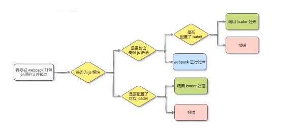

#### 打包处理css文件

1.运行npm i style-loader@3.0.0 css-loader@5.2.6 -D 命令安装处理css文件的loader

2.在webpack.config.js的module->rules数组中，添加loader规则如下：

```javascript
module:{
        // 所有第三方模块匹配规则
        rules:[
            // 文件后缀名匹配规则
            {test:/\.css$/,use:['style-loader','css-loader']}
        ]
    }
```

其中，test表示匹配的文件类型，use表示对应要调用的loader

注意：

* use数组中指定的loader 顺序是固定的
* 多个loader的调用顺序是 从后往前调用

#### 打包处理less文件

1.运行npm i less-loader@10.0.1 less@4.1.1 -D 命令

2.在webpack.config.js的module->rules数组中，添加loader规则如下：

```javascript
module:{
        // 所有第三方模块匹配规则
        rules:[
            // 文件后缀名匹配规则
            {test:/\.less$/,use:['style-loader','css-loader','less-loader']}
        ]
    }
```

其中，test表示匹配的文件类型，use表示对应要调用的loader

#### 打包处理样式表中与url路径相关的文件

1.运行npm i url-loader@4.1.1 file-loader@6.2.0 -D命令

2.在webpack.config.js的module -> rules数组中，添加load规则如下

```javascript
module:{
    // 所有第三方模块匹配规则
    rules:[
        // 文件后缀名匹配规则
        {test:/\.jpg|png|gif$/,use:['url-loader?limmit=22229']},
    ]
}
```

其中？之后是loader的参数项：

* limit用来指定图片大小，单位是字节（byte）
* 只有<=limit大小的图片才会被转为base64

##### base64图片的优缺点

优点：可以避免无效的请求

缺点：图片转化为base64格式后体积会稍微增大

#### 介绍webpack处理样式的过程

直接在index.js中引入css，less问就按即可，模块化开发

#### 打包处理js文件中的高级语法

webpack只能打包处理一部分高级的javascript语法，对于那些webpack无法处理的高级语法，需要借助于bable-loader进行打包处理。例如webpack无法处理下面的javascript语法

```javascript
// 定义一个装饰器函数
function info(target){
    target.info='Person info'
}
// 定义一个普通的类
@info
class Person{}

console.log(Person.info)
```

##### 安装bable-loader相关的包

运行如下命令安装对应的依赖包

npm i babel-loader@8.2.2 @babel/core@7.14.6 @babel/plugin-proposal-decorators@7.14.5 -D

在webpack.config.js的module -> rules数组中，添加loader规则如下：

```javascript
{test:/\.js$/,use:['babel-loader'],exclude:/node_modiles/},
```

##### 配置bable-loader

在根目录下，创建名为babel.config.js的配置文件，定义Babel的配置项如下：

```javascript
module.exports={
    // 声明 babel可用的插件
    // 将来 webpack 在调用 babel-loader 的时候 会先加载 plugin插件来使用
    plugins:[['@babel/plugin-proposal-decorators',{legacy:true}]]
}

```

### 发布

#### 配置build命令

##### 配置webpack的打包发布

在package.json文件的scripts节点下，新增build命令如下：

```javascript
 "scripts": {
    "dev": "webpack serve",
    "build": "webpack --mode production" 
  },
```

--model是一个参数项，用来指定webpack的运行模式，production代表生产环境，会对打包生成的文件进行代码压缩和性能优化

注意：通过--model指定的参数项，会覆盖webpack.config.js中的model选项 --mode优先级更高

##### 统一目录

###### 把javascript文件同意生成到js目录中

```javascript
output:{
        // 存放目录
        path:path.join(__dirname,'dist'),
        // 生成的文件名
        filename:'js/bundle.js'
    },
```

###### 把图片文件同意生成到image目录中

在webpack.config.js配置文件中url-loader配置项，新增outputPath选项即可指定图片文件的输出路径：

```javascript
{test:/\.jpg|png|gif$/,use:['url-loaderlimmit=22229&outputPath=images']},
   
```

##### 配置和使用clean-webpack-plugin

作用：自动清理dist目录下的旧文件夹

使用npm install --save-dev clean-webpack-plugin 安装

```javascript
// 导入clean-webpack-plugin
const { CleanWebpackPlugin } = require('clean-webpack-plugin');
const cleanPlugin=new CleanWebpackPlugin();
module.exports={
  plugins:[htmlPlugin,cleanPlugin]
}
```

### SourceMap

#### 什么是SourceMap

SourceMap就是一个信息文件，里面储存着位置信息，也就是说，SourceMap文件中储存着压缩混淆候得代码，所对应的转换前的位置

有了它，出错的对象，除错的工具将直接i西安市原始代码，而不是转化后的代码，能够极大的方便后期调试

#### 默认SourceMap问题

开发环境下默认生成的SourceMap，记录的是生成后代码的位置，会导致运行时报错的行数与源代码的行数不一致的问题示例图如下

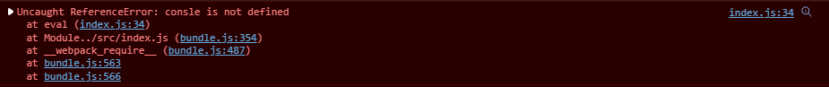

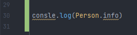

#### 解决默认SourceMap的问题

开发环境下，推荐webpack.config.js中添加如下的配置，即可保证运行时报错的行数与源代码的行数保持一致

#### webpack生产环境下的SourceMap

在生产环境下，如果省略了devtool选项，则最终生成的文件不包含SourceMap。这能够防止原始代码通过SourceMap的形式暴露给别有所图之认，提高了代码的安全性

#### 只定位行数不暴露源码

在生产环境下，如果只想定位报错的具体行数，且不想暴露行码，此时可以将devtool的值设置为nosource-source-map。实际效果如图

~~~javascript
//实际发布时可以选择下行代码或者直接关闭SourceMap
devtool:'nosources-source-map'
~~~

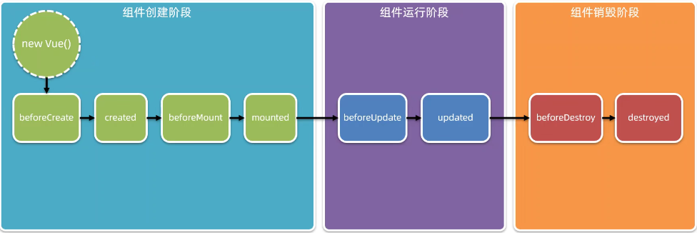

#### SourceMap最佳实践

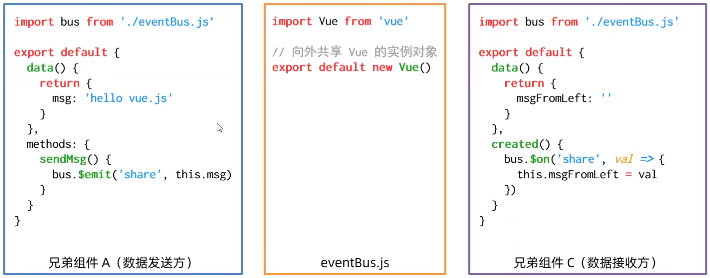

### @的配置

```javascript
resolve:{
        alias:{
            // 告诉webpack程序员写的代码中@代表src目录
            '@':path.join(__dirname,'./src/')
        }
    }
```

### 在chrome中安装vue-devtools调试工具

## Vue基础入门

### 什么是vue

一套用于构建用户界面的前端框架

* 构建用户界面：用vue往html中填充数据
* 框架：一套现成的解决方案，程序员只能遵守框架的规范，学习vue就是学习框架用法（指令，组件，路由，vuex）
* 只有把以上内容掌握，才有开发vue项目能力

### vue特性

在vue页面中，vue会监听数据变化，从而自动重新渲染页面结构

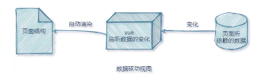

好处：数据变化时，页面重新渲染

坏处：数据驱动视图时双向绑定

#### 1.提高开发效率，不再操作dom，解放用户的双手

#### 2.框架和库的区别

```
框架是一套完整的解决方案，对项目的侵入性比较大，更换框架=重写项目
    库是提供某一个小功能，对项目的侵入性比较小，如果某个库无法完成某些需求，可以切换其他库
```

#### 3.MVC和MVVM之间的区别

```
MVC是后端开发概念，M为Model层，V是View层看作前端页面，C相当于业务逻辑层
```


MVVM是前端视图层的概念，主要把每个页面分成了M，V和VM。其中VM是MVVM思想的核心，因为VM是M和VM之间的调度者，M保存的是每个页面中单独的数据，V就是每个页面中的HTML结构,每当V层想要获取和保存数据的时候，都要由VM做中间件处理
好处：前端页面使用MVVM的思想主要是为了方便开发，应为MVVM提供了数据的双向绑定（由VM提供）

#### 4.Vue中的基本代码和MVVM之间的对应关系

~~~html
<!DOCTYPE html>
<html lang="en">
<head>
    <meta charset="UTF-8">
    <meta http-equiv="X-UA-Compatible" content="IE=edge">
    <meta name="viewport" content="width=device-width, initial-scale=1.0">
    <title>Document</title>
    <script src="./lib/vue.min.js"></script>
</head>
<body>
<div id="app">
    <p>{{msg}}</p>
</div>
<script>
    // 创建Vue实例
    // 导入包后浏览器内存中多了一个Vue的构造函数
    // new出来的这个vm对象就是MVVM中的VM调度者
    var vue=new Vue({
        el: '#app', //标识当前new的vue实例控制页面中哪个区域
        // 这里的data就是MVVM中的M，专门用来保存每个页面的数据
        data:{
            // data属性中存放的是el中要用的数据
            // 通过vue提供的指令很方便的操纵dom
            msg:"hello Vue!"
        }
    }）
    </script>
<body>
</html>
~~~

#### 5.v-clock,v-text,v-html,v-pre的使用

v-clock:先通过样式隐藏内容,然后在内存中进行值得替换并显示最终结果
使用v-clock让用户看不到插值表达式闪烁，当vue.js在后边引用时
v-text:默认v-text没有闪烁问题，v-text会覆盖元素中原始内容，但是插值表达式只会替换自己的占位符，不会把整个元素覆盖
v-html可以直接渲染html标签
v-pre填充原始信息,显示原始信息,跳过编译过程

<!DOCTYPE html>

<html lang="en">
<head>
    <meta charset="UTF-8">
    <meta http-equiv="X-UA-Compatible" content="IE=edge">
    <meta name="viewport" content="width=device-width, initial-scale=1.0">
    <title>Document</title>
    <script src="./lib/vue.min.js"></script>
    <style>
        [v-clock]{
            display: none;
        }
    </style>
</head>
<body>
  <div id="app">
        <p v-clock>{{msg}}</p>
        <h4 v-text="msg"></h4>
        <span v-html="msg2"></span>
    </div>
    <script>
        var vue=new Vue({
            el: '#app',
            data:{
                msg:"hello Vue!",
                msg2:'<h3>v-html</h3>'
            }
        })
    </script>  
</body>
</html>

#### 6.v-bind指令学习

提供绑定属性的一个指令

```html
<input type="button" name="" v-bind:title="mytitle" value="button">
```

v-bind属性可以简洁为一个：要绑定的属性，且v-bind中可以写合法的表达式

```html
<input type="button" name="" :title="mytitle +'123'' " value="button">
```

mytitle:'自定义title'
允许v-bind绑定属性值期间，如果绑定内容需要进行动态拼接，则字符串的外面应该包裹单引号如

`<P :title="'box'+index">BOX</P>`

#### 7.v-on指令学习

提供绑定事件的一个指令v-on:=@

```html
 <body>

    <div id="app">
        <input type="button" :title="mytitle" value="Button" v-on:click="show">
    </div>
    <script>
        var vue=new Vue({
            el:'#app',
            data:{
                mytitle:'自定义title',
            },
            methods:{
                // 在methods属性中定义了当前Vue实例所有可用的方法
                show:function(){
                    alert('show');
                }
            }
        })
    </script>

</body>
```

#### 8.跑马灯效果

```html
<body>
    <script src="./lib/vue.min.js"></script>
    <div id="app">
        <input type="button" value="开始" @click="run">
        <input type="button" value="暂停" @click="stop">
        <h3>{{msg}}</h3>
    </div>
    <script>
        var vue = new Vue({
            el: '#app',
            data: {
                msg: '跑马灯效果展示~~~~~~~~~~~',
                intervalId: null // 在data上定义定时器Id
            },
            methods: {
                // 在methods属性中定义了当前Vue实例所有可用的方法
                run() {
                    if (this.intervalId != null) {
                        return
                    }
                    this.intervalId = setInterval(() => {
                        console.log(this.msg);
                        let start = this.msg.substring(0, 1);
                        let end = this.msg.substring(1);
                        this.msg = end + start;
                    }, 100);
                },
                stop() {
                    clearInterval(this.intervalId);
                }
            }
        })
        // 给跑起来绑定一个点击事件 v-on @
        // 在按钮的事件处理函数中写相关的业务
        // 逻辑代码：拿到msg字符串然后调用字符串的substring来进行字符串截取放到最后一个位置
        // 为了实现需用到定时器
        // 在vm实例中想要获取data上数据或者想要调用methods方法，需用this来调用
        // vm实例会监听自己身上data中数据的改变，只要数据变化，就会重新同步
    </script>
</body>
```

#### 9.事件修饰符

放在事件后
.stop:阻止事件向上冒泡
.prevent:阻止默认行为
.capture:事件捕获机制
.self:只有点击当前元素才会触发事件
.once:事件只执行一次

#### 10.数据响应式

html5中的响应式(屏幕尺寸的变化导致样式变化)
数据响应式(数据变化导致页面内容的变化)
数据绑定:将数据填充标签中

#### 11.双向数据绑定

v-model
v-model只能和特殊的元素搭配使用
input,textarea,select

```html
<input type="text" value="" v-model="msg" @keyup.enter="enter">
```

##### v-model指令修饰符

为了方便对用户内容做处理，vue为vue-model指令提供了3个修饰符，分别是：


| 修饰符  | 作用                           | 示例                           |
| --------- | -------------------------------- | -------------------------------- |
| .number | 自动将用户的输入值转为数值类型 | <input v-model.number="age" /> |
| .trim   | 自动过滤用户输入的守卫空白字符 | <input v-model.trim="msg" />   |
| .lazy   | 在"change"时而非"input"时更新  | <input v-model.lazy="msg" />   |

#### 12.插值表达式不能用于属性节点

插值表达式支持简单运算
可以进行简单的数据拼接

#### 13.事件对象$event

vue提供了内置变量，名字叫做$event，他就是原生的DOM对象 e

~~~javascript
<button @click="add(3,$event)">+1</button>
add(n,e){
                this.count+=n
                console.log(e)
                if(this.count%2===0){
                    e.target.style.backgroundColor='pink'
                }else {
                    e.target.style.backgroundColor=''
                }
            }
~~~

#### 14.按键修饰符

~~~javascript
<div id="app">
    <input type="text" @keyup.esc="clearInput" @keyup.enter="commitAjax">
</div>
<script>
    const app = new Vue({
        el: '#app',
        data: {
            msg:'xxxxx'
        },
        methods:{
            clearInput(e){
                console.log('clearInput')
                e.target.value=null
            },
            commitAjax(){
                console.log('commitAjax')
            }
        }
    })
</script>
~~~

#### 15.条件渲染指令

v-if：每次动态创建和移除元素创建删除节点,来实现（进入页面，某些元素默认不显示，后期可能也不显示才使用v-if）
v-show:动态为元素添加display:none样式来实现元素显示隐藏（频繁切换性能更好）
在实际开发中绝大多数勤快，不用考虑性能，直接v-if
v-else-if：必须配合v-if使用，实现多项判断
v-else：v-if的相反情况

#### 16.列表渲染指令

vue提供了v-for列表渲染指令，用来辅助开发者继续一个数组来循环渲染列表结构。v-for指令需要用item in items 形式语法中
key属性绑定,官方建议只要用到v-for一定要绑定一个key，key值最好为item.id（提升性能，防止列表状态紊乱）
官方对key值的类型是有要求的，字符串或数字类型
key的值是千万不能重复的，否则终端会报错：Duplicate keys detected

- items是待循环的数组
- item是被循环的每一项

#### 案例：

~~~javascript
<!DOCTYPE html>
<html lang="en" xmlns="http://www.w3.org/1999/html" xmlns="http://www.w3.org/1999/html">
<head>
    <meta charset="UTF-8">
    <title>Title</title>
    <script src="../vue.js"></script>
    <style>
        *{
            margin: 20px;
        }
        #app{
            display: flex;
            justify-content: center;
            align-items: center;
            flex-direction: column;
        }
        #app table{
            margin-top: 80px;
            border: 1px solid black;
            border-spacing: 0;
            /*border-color:black ;*/
        }
        tr{
            width: 100px;
        }
        td{
            border: 1px solid black;
            text-align: center;
            width: 200px;
            height: 50px;
            /*background-color: pink;*/
        }
    </style>
</head>
<body>
<div id="app">
    <form @submit.prevent="add">
        <input type="text" v-model.trim="msg"> <button type="submit">添加</button>
        <table>
            <thead>
            <tr>
                <td>#</td>
                <!--                <td>id</td>-->
                <td>名称</td>
                <td>状态</td>
                <td style="width: 300px">创建时间</td>
                <td>操作</td>
            </tr>
            </thead>
            <tbody>
            <tr v-for="item in list" :key="item.id">
                <!--            <td>{{index}}</td>-->
                <td>{{item.id}}</td>
                <td>{{item.name}}</td>
                <td>
                    <input type="checkbox" :id="'cb'+item.id" v-model="item.state">
                    <label v-if="item.state" :for="'cb'+item.id">已启用</label>
                    <label v-else :for="'cb'+item.id">已禁用</label>
                </td>
                <td style="width: 300px">{{item.createTime}}</td>
                <td @click="remove(item.id)">删除</td>
            </tr>
            </tbody>
        </table>
    </form>
</div>
<script>
    const app = new Vue({
        el: '#app',
        data: {
            msg:'',
            nextId:4,
            list:[
                {id:1,name: '宝马',state:true,createTime:new Date()},
                {id:2,name: '奔驰',state:false,createTime:new Date()},
                {id:3,name: '奥迪',state:true,createTime:new Date()},
            ]
        },
        methods:{
            add(){
                if(!this.msg) return alert('必须填写名称')
                const addObj={
                    id:this.nextId,
                    name:this.msg,
                    state:true,
                    createTime:new Date()
                }
                this.list.push(addObj)
                this.nextId++
                this.msg=''
            },
            remove(id){
                console.log(id)
                this.list=this.list.filter(item=>item.id!==id)
            }
        }
    })
</script>
</body>
</html>
~~~

#### 17.过滤器

过滤器是vue开发者提供的功能，常用于文本的格式化，过滤器可以和v-bind绑定
过滤器应该被添加在javascript表达式的尾部，由管道符进行调用，示例代码如下

##### 私有过滤器和全局过滤器

在filters节点下定义的过滤器，称为“私有过滤器”，因为它只能在当前vm示例所
控制的el区域内使用，如果希望在多个vue实例之间共享过滤器，则可可以按照如下格式定义全局过滤器

`<p>message的值是：{{msg | capi}}</p>`

~~~javascript
 filters:{
            // 过滤器形参中的val永远是管道符|前的值
            capi(val){
                // 字符串由charAt方法 这个方法接收一个索引值，表示从字符串中把索引对应的值
                const first=val.charAt(0).toUpperCase()
                const other=val.slice(1)
                //过滤器钟一定要有一个返回值
                return first + other
            }
        }
~~~

~~~javascript
// Vue.filter 方法接收两个参数
    // 第一个参数是全局过滤器的名字
    // 第二个参数是全局过滤器的处理函数
    Vue.filter('capi',str=>{
        return str.charAt(0).toUpperCase()+str.slice(1)+'--'
    })
~~~

##### 过滤器的注意点

- 要定义到filters节点下，本质是一个函数
- 在过滤器函数中，一定要有return值
- 在过滤器的形参中，就可以获取到管道符前面待处理的那个值
- 如果全局过滤器和私有过滤器名字一致，此时就按照就近原则，调用私有过滤器

##### 过滤器格式化时间

~~~javascript
    Vue.filter('dateFormat',time=>{
        const dt=dayjs(time).format('YYYY-MM-DD HH-mm-ss')
        return dt
    })
~~~

#### 串联的使用过滤器

过滤器可以串联调用
`<P>{message | filter1 | filter2 | filter3 }</p>`

#### 调用过滤器还可以传参

过滤器的本质是javascript函数，因此可以接受参数
`<P>{message | filter(arg1 , arg2) }</p>`
// 过滤器处理函数的形参列表中
// 第一个参数永远是管道符前待处理的参数
// 从第二个参数开始，才是调用过滤器时对传递过来的arg1，arg2参数

~~~javascript
Vue.filter('filter',(msg,arg1,arg2)=>{
    // 过滤器代码逻辑
 }
)
~~~

#### 过滤器的兼容性

vue3不支持过滤器

#### 18.监听器

##### 什么是监听器

监听器允许开发者监视数据的变化，从而针对数据变化做特定动作
语法格式如下：

~~~javascript
watch:{
            // 监听器本质上是一个函数，要监视哪个数据的变化，就把数据名做方法名即可
            // newVal 变化后的新值 oldVal 变化后的旧值
            // 新值在前 旧值在后
            msg(newVal,oldVal) {
                console.log(oldVal + '-----已更改为-----' + newVal)
            }
        }
~~~

应用场景：查询用户名是否重复，当旧值更改时就通过接口查询

##### 对象格式的监听器

// immediate 选项的默认值是 false
// immediate 的作用是控制侦听器是否自动触发一次
immediate:true

~~~javascript
watch:{
            // 对象格式的监听器
            msg:{
                // 侦听器的处理函数
                handle (newVal,oldVal) {
                    console.log(newVal,oldVal)
                } ,
                // immediate 选项的默认值是 false
                // immediate 的作用是控制侦听器是否自动触发一次
                immediate:true
            }
        }
~~~

##### 深度侦听

如果是对象属性发生变化无法触发监听器
可以通过deep选项深度监听属性变化

~~~javascript
watch:{
            // 对象格式的监听器
            info:{
                handle(newVal){
                    console.log(newVal)
                },
                // 开启深度监听，只要对象中任何一个属性变化，都会触发对象监听器
                deep:true
            }
        }
~~~

~~~javascript
watch:{
            // 对象格式的监听器
            'info.msg'(newVal){
                console.log(newVal)
            }
        }
~~~

#### 19.计算属性

指是通过一系列运算之后，最终得到的一个属性值
这个动态计算出来的属性值可以被模板结构或methods方法使用，示例代码如下：

~~~html
<!DOCTYPE html>
<html lang="en" xmlns="http://www.w3.org/1999/html" xmlns="http://www.w3.org/1999/html"
xmlns="http://www.w3.org/1999/html">
    <head>
    <meta charset="UTF-8">
    <title>Title</title>
<script src="../vue.js"></script>
<script src="https://cdn.bootcdn.net/ajax/libs/dayjs/1.4.1/dayjs.min.js"></script>
<style>
    .box{
    width: 200px;
    height: 200px;
}
</style>
</head>
<body>
    <div id="app">
        r:<input type="text" v-model="r">
    </br>
        g:<input type="text" v-model="g">
    </br>
        b:<input type="text" v-model="b">
    </br>
        <div class="box" :style="{backgroundColor:rgb}">
        {{rgb}}
    </div>
    <button @click="show">按钮</button>
</div>
<script>

    const app = new Vue({
    el: '#app',
    data: {
    r:255,
    g:0,
    b:0
},
    methods:{
    show(){
    console.log(this.rgb)
}
},
    // 监听属性
    watch:{},
    // 计算属性
    // 所有的计算属性都要定义到computed节点下
    // 计算属性在定义的时候，要定义成方法格式
    computed:{
    // rgb作为一个计算属性被定义为方法格式
    // 最终，在这个方法中，要返回一个生成好的rgb(x,x,x)
    rgb(){
    return `rgb(${this.r},${this.g},${this.b})`
}
}
})
    console.log(app)
</script>
</body>
</html>
~~~

##### 特点

- 定义的时候要被定义为方法
- 在使用计算属性的时候，当普通的属性使用即可

##### 好处

- 实现了代码复用
- 只要计算属性中依赖的数据源变化了，则计算属性会自动重新求值

#### 19：axios

##### 基础语法

~~~javascript
axios({
        method:'请求类型',
        url:'请求地址',
    }).then(result=>{
        // .then用来指定请求成功后的回调函数
        // 形参中的 result 是请求成功后的结果
    })
~~~

调用axios得到的返回值是一个promise对象
axios在请求到数据后，在真正的数据外套了一层壳

~~~javascript
{
    config:{},
    data:{'真实数据'},
    headers:{},
    request:{},
    status:xxx,
    statusText:''  
}
~~~

##### 基本使用

- 发起get请求

~~~javascript
    axios({
    method:'GET',
    url:'请求地址',
    // url中查询参数 (get)
    params:{
        id:1
    },
}).then(result=>{
    // .then用来指定请求成功后的回调函数
    // 形参中的 result 是请求成功后的结果
    console.log(result)
})
~~~

- 发起post请求

~~~javascript
    axios({
    method:'POST',
    url:'请求地址',
    // url中查询参数 (get)
    data:{
        name:'zhangsan',
        age:20
    },
}).then(result=>{
    // .then用来指定请求成功后的回调函数
    // 形参中的 result 是请求成功后的结果
    console.log(result)
})
~~~

##### await async

通过await可以获取到返回值，而不是promise
对象，但必须用在async修饰的方法中

###### 解构赋值

~~~vue
  async getData(){
    const {data:res}=await axios({
        method:'POST',
        url:'xxxxxxx',
        // 请求体参数 (post)
        data:{}
    })
    console.log(res)
}
~~~

##### 简化

访问方法

~~~vue
  async getData(){
    const {data:resPost}=await axios.post('http://xxx.xxx.xxx',{name:'xxx'})
    const {data:resGet}=await axios.get('http://xxx.xxx.xxx',{params:{name:'xxx'}})
    console.log(resPost)
    console.log(resGet)
}
~~~

#### 20.vue-cli

单页面程序（Single Page Application），简称SPA,顾名思义，指的是一个Web网站只有唯一一个HTML界面，
所有的功能与交互都在这唯一的一个页面内完成。

##### 什么是vue-cli

vue-cli是Vue.js开发的标准工具。它简化了程序员基于Webpack创建工程化Vue项目的过程。
引用vue-cli官网上一句话，承轩u你可以专注于撰写应用，而不必花好几天纠结webpack配置

##### 安装和使用

vue-cli是npm上一个全局包，使用npm install 命令，即可方便的把它安装到电脑上
`npm install -g @vue/cli`
1.基于vue-cli快速生成工程化Vue项目
`vue create 项目名称`
2.vue项目中src目录的构成

- assets 文件夹：存放项目中的静态资源文件
- components 文件夹：程序员封装的可复用组件都要放到components 目录下
- main.js  入口文件：整个项目的执行都要先执行该入口文件
- App.vue 项目的根组件：

Vue实例的$mount()方法，作用和el属性完全一样

#### vue组件

组件化开发指的是：根据封装的思想，把页面上可重用的UI结构封装为组件，从而方便项目开发和维护

##### vue组件的三个部分

- template 组件模板结构
- script 组件的javascript行为
- style 组件的css样式(默认css语法)加上lang可以改成其他语法
- `<style lang="less"></style>`

~~~javascript
<template>
  <div id="app">
    <p>{{msg}}</p>
    <button @click="changeMsg">按钮</button>
  </div>
</template>

<script>
  // 默认导出，固定语法
  export default {
    // data 数据源
    // 注意：vue组件中的data不能像之前一样，不能指向对象
    // 注意：组件中的data必须是一个函数
    data(){
        return{
          msg:0
        }
    },
    methods:{
      changeMsg(e){
        this.msg+=1
        // 在组件中 this就表示当前组建的实例对象
        console.log(this)
      }
    },
    watch:{},
    computed:{},
    filters:{}
  }
</script>

<style>
  #app{
    background-color: pink;
  }
</style>
~~~

##### 组件之间的父子关系

组件在封装好之后是相互独立的，不存在父子关系
使用组建的三个步骤

- 使用import语法导入需要的组件
- 使用components节点组测组件
- 以标签的形式使用刚才注册的组件

##### 通过components注册的是私有组件

例如：在组件A的components节点下，注册了组件F
则组件F只能用个在组件A中，不能用被用在组件C中
缺点：多次复用时很麻烦
实例代码如下:

~~~javascript
// main.js
// 导入需要被全局注册的组件
import Count from '@/components/Count'
Vue.component('MyCount',Count)
~~~

##### 注册全局组件

在vue项目的main.js文件中,通过Vue.component()方法，可以注册全局组件，示例代码如下

##### 组件中的props

props是组件的自定义属性，在封装组件的时候，合理的使用props可以极大的提高组件的复用性
自定义属性名字是封装这自定义的（'合法即可'）
格式语法如下：

~~~javascript
export default {
  // props是自定义属性，允许使用者通过自定义属性，为当前组件指定初始值
  props:['init'],
  data(){
    return{}
  },
  methods:{}
}
~~~

##### 结合v-bind使用自定义属性

v-bind内的值是javascript数字不加的话为普通字符串

##### props里的数据是只读的

程序员不能直接修改props里的值，负责终端会报错
可以把props里的值转存到data中

~~~javascript
export default {
    // props是自定义属性，允许使用者通过自定义属性，为当前组件指定初始值
    props: ['init'],
    name: "Count",
    data() {
        return {
            count: this.init
        }
    }
}
~~~

##### props默认值

定义对象里的props
实例代码如下：

~~~javascript
export default {
    // props是自定义属性，允许使用者通过自定义属性，为当前组件指定初始值
    props: {
        init: {
            default: 0
        }
    },
    name: "Count",
    data() {
        return {
            count: this.init
        }
    }
}
~~~

##### props里的 type 值类型

type:

- String
- Number
- Boolean
- Array
- Object
  示例代码：

~~~javascript
export default {
    // props是自定义属性，允许使用者通过自定义属性，为当前组件指定初始值
    props: {
        init: {
            default: 0,
            type:Number
        }
    },
    name: "Count",
    data() {
        return {
            count: this.init
        }
    }
}
~~~

##### props里的必填required

当required为true，如果不传值就会报错，有默认值也没用

~~~vue
export default {
    // props是自定义属性，允许使用者通过自定义属性，为当前组件指定初始值
    props: {
        init: {
            default: 0,
            type:Number,
            required:true
        }
    },
    name: "Count",
    data() {
        return {
            count: this.init
        }
    }
}
~~~

##### 组件之间的样式冲突问题

默认情况下，写在.vue组件中的样式会全局生效，因此会造成多个组件之间的样式冲突问题。
导致组件之间样式冲突的根本原因是：
①：单页面应用程序中，所有组件的DOM结构，都是基于唯一的index.html页面呈现的
②：每个组件中的样式，都会影响整个index.html页面中的Dom元素
如何解决：

- 给当前组件内的标签中加入自定义属性
  `data-v-xxx`
  `h1[data-v-xxx]{xxx}`
- 在style标签内加入scoped属性，防止组件间样式冲突
- 在父组件中更改子组件的样式
  当使用第三方库时需要用到/deep/，更改子组件的子元素
  `h1[data-v-xxx]{}`/deep/前
  `[data-v-xxx]h1{}`/deep/后
  `/deep/ h1{}`

### 生命周期&数据共享

#### 组件间的生命周期

生命周期是指一个组件从创建->运行->销毁的整个阶段，强调的是一个时间段
生命周期函数：是由vue框架提供的内置函数，会伴随着组件的生命周期，自动按次序执行

注意：生命周期强调的是时间段，生命周期函数强调的是时间点

##### 创建阶段生命周期函数

- beforeCreate(){} 组件的props/data/methods尚未被创建，都处于不可用状态
- created(){} 组件的props/data/methods已创建好，处于可用状态，但是组建的模板结构尚未生成
- beforeMount(){} 将要把内存中编译好的HTML结构渲染到浏览器中，此时浏览器中还没有当前组件的DOM结构
- mounted(){} 已经把内存中的HTML结构，成功的渲染到浏览器中，此时浏览器中已然包含了当前组建的DOM结构

##### 运行阶段生命周期函数

- beforeUpdate(){} 将要根据变化后，最新的数据，重新渲染组件的模板结构。（此时还未渲染）
- updated(){} 已经根据最新的数据，完成了组件DOM结构的重新渲染，数据变化之后为了操作最新的数据，必须放在updated生命周期函数里

##### 销毁阶段生命周期函数

- beforeDestroy(){} 将要销毁此组件，此时尚未销毁，组件还处于正常工作的状态
- destroy(){} 组件已经被销毁，此组件在浏览器中对应的DOM结构已经被完全移除

#### 组件间的数据共享

##### 父组件向子组件传递数据

父组件向子组件共享数据需要使用自定义属性
不能修改props里的值，只能转存

- 父

~~~vue
<Son :msg="message" :user="userInfo"></Son>
~~~

- 子

~~~javascript
<template>
  <div class="son">
    <h1>Son 组件</h1>
    <p>父组件传递过来的 msg 值为：{{msg}}</p>
    <p>父组件传递过来的 user 值为：{{user}}</p>
  </div>
</template>

<script>
export default {
  props:['msg','user'],
  name: "Son"
}
</script>
~~~

##### 子组件向父组件传值

- 子
  `this.$emit('numChange',this.num)`
- 父
  `<right @numChange="getNewNum"></right>`

~~~javascript
getNewNum(val){
      this.numFromSon=val
    }
~~~

##### 兄弟组件之间的传值

在vue2.x中，兄弟组件之间数据共享的方案是EventBus
EventBus的使用步骤

- 创建eventBus.js模块，并向外共享一个Vue的实例对象
- 在数据发送方，调用bus.$emit('时间名称',要发送的数据)方法触发自定义事件
- 在数据接收方，调用bus.$on('事件名称',事件处理函数)方法注册一个自定义事件
  

#### ref引用

##### 什么是ref引用

ref用来辅助开发者在不依赖jQuery的情况下，获取DOM元素或组件的引用

##### 使用ref引用组件

`<Left ref="left"></Left>`
`console.log(this.$refs.left)`

##### this.$nextTick(cb)方法

组件的$nextTick(cb)方法，会把cb回调推迟到下一个DOM更新周期之后执行。通俗的理解是：
等组件DOM更新完成之后，在执行cb回调函数，从而能保证cb回调函数可以操作到最新的DOM元素

#### 数组中的的方法

##### forEach

forEach一旦开始无法终止

~~~javascript
const arr=['小红','大红','小强','大强']
arr.forEach((item,index)=>{
    console.log('ok')
    if (item==='小强'){
        console.log(index)
    }
})
~~~

##### some

当循环满足条件时，使用return true跳出循环

~~~javascript
const arr=['小红','大红','小强','大强']
arr.some((item,index)=>{
    console.log('ok')
    if (item==='小强'){
        console.log(index)
        return true
    }
})
~~~

##### every

every返回值为true或false
当循环的值都满足条件时返回true反之返回false

~~~javascript
const arr=[
            {id:1,name:'西瓜',state:true},
            {id:2,name:'榴莲',state:true},
            {id:3,name:'苹果',state:true},
            {id:4,name:'草莓',state:true}
        ]
        // 判断数组中水果是否被全选
const everyFlag=arr.every(item=>item.state)
console.log(everyFlag) // true
~~~

##### reduce

`arr.filter(item=>item.state).reduce((累加的结果，当前循环项)=>{},初始值)`

~~~javascript
const arr=[
            {id:1,name:'西瓜',state:true,price:10,count:1},
            {id:2,name:'榴莲',state:false,price:80,count:2},
            {id:3,name:'苹果',state:true,price:6,count:3},
            {id:4,name:'草莓',state:true,price: 20,count:4}
        ]
// 需求：把购物车中勾选的结果，总价累加起来
const result=arr.filter(item=>item.state).reduce((amt,item)=>{
    return amt+=item.price*item.count
},0)
console.log(result) // 108
~~~

#### 购物车案例

### 动态组件

vue专门提供了一个内置的<component>组件，专门用来实现动态组建的渲染，实例代码如下：

~~~javascript
<component :is="comName"></component>
data(){
    return{
        comName:'Left'
    }
}
~~~

#### keep-alive保持状态

动态组件每一次切换时都会被销毁

~~~javascript
<keep-alive>
        <component :is="comName"></component>
</keep-alive>
~~~

keep-alive可以把内部组件进行缓存,而不是被销毁

#### keep-alive对应生命周期函数

当组件被缓存时,会触发组建的deactivated生命周期函数
当组件被激活时,会触发组件的activated生命周期函数

#### keep-alive的include,exclude属性

include包含缓存的组件
exclude不包含缓存组件
二者只能存在一个,不能同时存在include和exclude

~~~javascript
      <keep-alive include="Left,Right">
        <component :is="comName"></component>
      </keep-alive>
~~~

#### 组件注册的命名

如果在声明组件的时候没用为组件指定name,则组件默认的名称就为注册是的名称
1.注册名称主要用处是以标签的形式使用
2.组件声明时候的name名称的主要应用场景,结合<keep-alive>标签实现组建的缓存功能,以及在调试工具中看到组件的name名称

### 插槽

插槽(slot)是vue为组件的封装者提供的能力.阴虚开发者在封装组件的时候,把不确定的,希望用户指定的部分定义为插槽
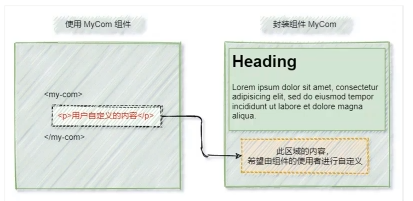

#### slot名称

vue官方规定,每一个slot插槽都要有一个name名称
如果省略了slot的name属性,则有一个默认名称叫做default
如果要把内容填充到指定名称中,需要使用 v-slot: 这个指令
v-slot: 后面要跟上插槽的名字
v-slot: 指令不能放在元素身上,必须用在template标签里
template是个虚拟标签,只起到一个包裹的作用,不会被渲染成实质的html指令

~~~vue
// APP.vue
<Left>
  <template v-slot:default>
          <p>一个p标签</p>
  </template>
</Left>
// Left.vue
<template>
  <div class="left">
    <h2>LEFT</h2>
    <br />
    <!--    声明一个插槽区-->
    <!--    vue官方规定,每一个slot插槽都要有一个name名称-->
    <!--    如果省略了slot的name属性,则有一个默认名称叫做default-->
    <slot name="default">

    </slot>
  </div>
</template>
~~~

v-slot: 指令的简写形式是 #

#### 后备内容

当父组件中不加如slot是可以使插槽显示默认内容

~~~vue
// 子组件
<slot name="default">
        slot插槽的默认内容
</slot>
// 父组件
<Left>
  <template v-slot:default>
      一个p标签
  </template>
</Left>
~~~

#### 具名插槽

~~~vue
  // 子组件
  <div class="article-container">
    <!--文章标题-->
    <div class="header-box">
      <slot name="title"></slot>
    </div>
    <!--文章内容-->
    <div class="content-box">
      <slot name="content"></slot>
    </div>
    <!--文章作者-->
    <div class="footer-box">
      <slot name="author"></slot>
    </div>
  </div>
  // 父组件
  <Article>
    <template #title>
      <h3>诗</h3>
    </template>
    <template #content>
      <h5>床前明月光</h5>
      <h5>疑是地上霜</h5>
      <h5>举头望明月</h5>
      <h5>低头思故乡</h5>
    </template>
    <template #author>
      <h6>李白</h6>
    </template>
  </Article>  
~~~

#### 作用域插槽的基本用法

在封装组件时，为预留的slot提供属性对应值，这种用法叫做‘作用域插槽’
接收使在名称后 #xxx='scope' 默认scope接收
这个值可以动态绑定
可以通过解构来获取值{xxx,yyy}

~~~vue
// 父组件
<template #content="msg">
  <h3>内容--{{msg.msg}}</h3>
</template>
// 子组件
<div class="content-box">
  <slot name="content" msg="hello slot"></slot>
</div>
~~~

#### 私有自定义指令

在每个vue组件中，可以在directives节点下声明私有自定义指令，示例代码如下：
和data同级

~~~javascript
<h1 v-color="color">APP根节点</h1>
<h2 v-color="'blue'">测试节点</h2>
data(){
    return{
        color:'pink'
    }
},
// 私有节点自定义指令
directives: {
    color:{
        // 单指令第一次被绑定到元素上时，会立即出发bind函数
        // 形参中的el表示当前指令绑定到那个DOM对象
        bind(el,binding){
            el.style.color=binding.value
            console.log(binding)
            // console.log('触发了bind')
        },
        // DOM更新时触发update函数
        update(el,binding){
            el.style.color=binding.value
            console.log(binding)
            // console.log('触发了update')
        }
    }
}
~~~

##### bind

bind函数只调用一次，当指令第一次绑定到元素时调用，当DOM更新时bind函数不会被触发。

##### update

update函数回在每次DOM更新时被调用

##### 函数简写

~~~javascript
// 私有节点自定义指令
  directives: {
    color(el,binding){
      el.style.color=binding.value
    }
  }
~~~

#### 全局自定义指令

全局共享的自定义指令需要通过Vue.directive()进行声明，实例代码如下
参数1：字符串，边是全是自定义子陵的名字
参数2：对象，用来接收指令的参数值

~~~javascript
// 全局自定义指令
Vue.directive('color',(el,binding)=>{
    el.style.color=binding.value
})
~~~

### ESLint

#### rules

存放自定义规则如：console输出，debugger调试
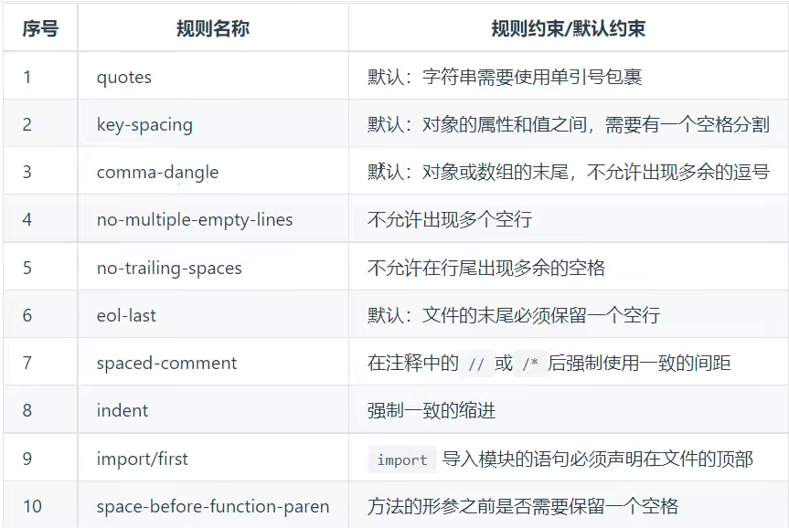
更多规则
[http://eslint.cn/docs/rules/](http://eslint.cn/docs/rules/)

#### 配置vscode工具

EsLint Dirk Baeumer
Prettier - code formatter

### axios

#### 基本用法

~~~vue
<button @click="getInfo">发起Get请求</button>
methods: {
    async getInfo () {
      const { data: res } = await axios.get('http://www.liulongbin.top:3006/api/get')
      console.log(res)
    }
  }
~~~

#### 把axios挂载到vue原型并配置请求根路径

##### 把axios挂载到vue原型

~~~vue
import axios from 'axios'
Vue.prototype.$http = axios
~~~

##### 配置请求根路径

`axios.defaults.baseURL = 'http://www.xxx.xxx'`

##### 缺点

- 无法实现api接口复用

### 路由

#### 前端路由的概念与原理

##### 什么是前端路由

通俗易懂的概念：Hash地址与组件之间的对应关系，不同的Hash展示不同组件

##### 前端路由的工作方式

- 用户点击了页面上的路由链接
- 导致了URL地址栏中的Hash值发生了变化
- 前端路由监听到了Hash地址的变化
- 前端路由把当前Hash地址对应的组件都渲染到浏览器中
- 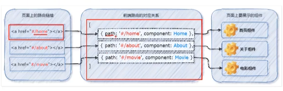

##### 前端路由原理

监听，改变hash地址

~~~javascript
created() {
    window.onhashchange=()=>{
      console.log('监听到了 hash 地址的变化',location.hash)
    }
  }
~~~

#### vue-router的基本使用

##### 什么是vue-router

vue-router是vue.js官方给出的路由解决方案，它只能结合vue项目进行使用，能够情感送的管理SPA项目
中的组件切换

#### vue-router的常见用法

##### 安装vue-router包

在vue2中：
`npm i vue-router@3.5.2 -S`

##### 创建路由模块

~~~javascript
// router.js
import Vue from 'vue'
import VueRouter from 'vue-router'

// 调用vue.use()函数，把vue-router安装为vue的插件
Vue.use(VueRouter)
// 创建路由的实例对象
const router = new VueRouter()
// 向外共享路由的实例对象
export default router
~~~

##### 导入并挂载路由模块

在进行模块化导入的时候，如果给定的是文件夹，则默认导入这个文件夹下名字叫做index
.js的文件

~~~javascript
// main.js
import Vue from 'vue'
import App from './App.vue'
import router from './router'

Vue.config.productionTip = false

new Vue({
    router, // 路由的实例对象
    render: h => h(App)
}).$mount('#app')

~~~

##### 声明路由链接和占位符

只要在项目中安装和配置了vue-router，都可以使用router-view这个组件
它的作用很单纯-占位符
`<router-view></router-view>`

#### 路由的基本用法

在路由模块中声明路由的对应关系

##### 使用redirect重定向

路由重定向指的是：用户在访问地址A的时候，强制用户跳转到地址C，从而展示特定的组件页面。
通过路由规则的redirect属性，指定一个新的路由地址，可以很方便的设置路由的重定向

~~~javascript
import Vue from 'vue'
import VueRouter from 'vue-router'
import Home from '@/components/Home'
Vue.use(VueRouter)

// routes 是一个数组，作用 定义hash地址与组件之间的关系
const routes = [
    // 路由规则
    // 当用户访问 / 的时候，通过redirect属性跳转到 /home 对应的路由规则
  {path: '/', redirect: '/home'},
  {path: '/home', name: 'Home', component: Home}
]
const router = new VueRouter({
    // routes 是一个数组，作用 定义hash地址与组件之间的关系
    routes
})

export default router
~~~

##### 嵌套路由

通过路由实现组件的嵌套展示，叫做嵌套路由
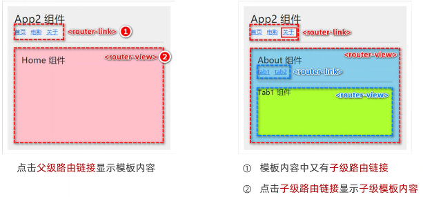

##### 通过children属性声明子路由规则

子路由规则不以斜线开头
在src/index.js路由模块中，导入需要的组件，并使用children属性声明子路由规则：

~~~javascript
{
    path: '/about',
    name: 'About',
    component: About,
    children:[
      {path:'tab1',name:'Tab1',component: Tab1},
      {path:'tab2',name:'Tab2',component: Tab2}
    ]
  }
~~~

##### 默认子路由

如果children数组中，某个路由规则的path值为空字符串，则这条路由规则叫做'默认子路由'
默认子路由和重定向功能相同

~~~javascript
{
    path: '/about',
    name: 'About',
    component: About, 
    children:[
      {path:'',name:'Tab1',component: Tab1},
      {path:'tab2',name:'Tab2',component: Tab2}
    ]
  }
~~~

#### 动态路由匹配

思考：有如下三个路由链接：
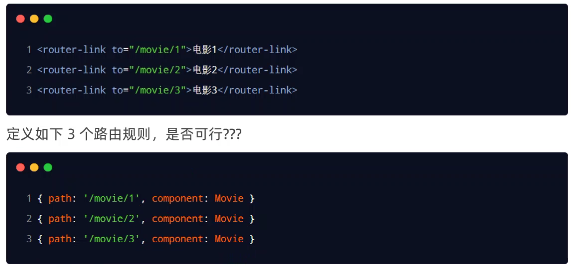
缺点：路由规则的复用性差

##### 动态路由的概念

动态路由是指：把Hash地址中的可变部分定义为参数向，从而提高路由规则的复用性
在vue-router中使用英文的：来定义路由的参数向。示例代码如下：
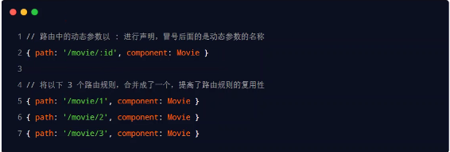

~~~javascript
  // 在movie组件中希望根据id的值展示对应电影的信息
  {
    path: '/movie/:id',
    name: 'Movie',
    component: Movie, 
    props:true
  }
~~~

- 可以通过`this.$route.params.id`来获取id值以便渲染数据
- 可以通过开启props:true开启prop传参 子组件： `props:['id'],`

##### 拓展query和fullpath

- 在hash地址中，/后面的参数项叫做路径参数
  在路由参数对象中，需要使用this.$route.params来访问路径参数
- 在hash地址中，?后面的参数项叫做查询参数
  在路由参数对象中，需要使用this.$route.query来访问查询参数
- 在this.$route中，path只是路径部分，fullPath是完整地址
  例如：/movie/2?name=zs&age=20 是fullPath的值 /movie/2是path的值

#### 编程式导航跳转

##### vue-router中编程式导航API，其中最常用的导航API分别是：

- this.$router.push('hash地址')
  - 跳转到指定的hash地址,并增加一条历史记录
- this.$router.replace('hash地址')
  - 跳转到指定的hash地址，并替换掉当前的历史记录
- this.$router.go(n) n 表示数字 -1 表示后退一层，如果后退层数超过上限则原地不动，同理 1 表示前进一层
##### $router.go的简化
- $router.back() 表示后退一层
- $router.forward() 表示前进一层

#### 路由导航守卫
##### 全局前置守卫
每次发生路由的导航跳转时，都会触发全局前置守卫。
因此，在全局前置守卫中，程序员可以对每个路由进行访问权限的控制
`router.beforeEach(fn)`
##### 守卫方法的三个形参
- to 将要访问的路由信息对象
- from 将要离开的路由信息对象
- next 是一个函数，调用next()表示放行，允许这次路由导航
~~~javascript
router.beforeEach((to,from,next)=>{
  // to表示将要访问的路由信息
  console.log(to)
  // next函数表示放行
  next()
})
~~~
##### next函数的三种调用方式
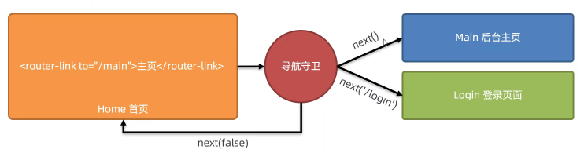
当前用户拥有后台主页的访问权限，直接放行：next()
当前用户没有后台主页的访问权限，前置其跳转到登录页面：next('/login)
当前用户没有后台主页的访问权限，不允许跳转到后台主页：next(false)
##### 前置守卫
~~~javascript
router.beforeEach((to,from,next)=>{
  // to表示将要访问的路由信息
  // from表示将要离开的路由的信息对象
  // next函数表示放行
  // 分析
  // 要拿到用户访问的hash地址
  // 判断hash地址是否等于 /main
  // 如果等于/main 证明需要登陆之后，才能访问成功
  // 如果不等于/main，则不需要登录，直接放行 next()
  // 如果访问的地址是 /main 则需要读取localstorage中的token值
  // 如果有token就放行
  // 如果没有token则强制跳转到登录页
  if(to.path==='/main'){
    const token=localStorage.getItem('token')
    if(token){
      next()
    }else{
      next('/login')
    }
  }
})
~~~
#### 后台管理案例

### JS高阶铺垫知识

#### ES6模块化
##### 回顾node.js中如何实现模块化
node.js 遵循了CommonJS的模块化规范，其中
- 导入其他模块时使用reuire()方法
- 模块对外共享成员使用module.exports对象
模块化好处：
- 大家都遵守同样的模块化规范写代码，降低了沟通成本，极大方便了哥哥模块之间的相互调用，利人利己。
##### 前端模块化规范的分类
在ES6模块化规范诞生之前，javacript社区已经尝试并提出了AMD,CMD,Commonjs等模块化规范。
但是这些由社区提出的模块化标准，还存在一定的差异性与局限性，并不是浏览器与服务器通用的模块化标准，例如：
- AMD和CMD适用于浏览器端的Javascript模块化
- CommonJS适用于服务器端的Javascript模块化
默认导出与默认导入
- 默认导出：默认导出的语法：export default 默认导出成员
- 默认导入：默认导入时的接受名称可以任意名称，只要是合法的成员名称即可
```javascript
let n1 = 10

function show() {
}

export default {
    n1,
    show
}
```
- 默认导入：默认导入语法：import 接收名称 from '模块标识符'
注意事项：
- 默认导出的注意事项：每个模块中只允许使用一次的export default 否则会报错
- 默认导入的注意事项：默认导入时的接受名称可以任意名称，只要是合法的成员名称即可
按需导出：
```javascript
let n1 = 10
let n2 = 20
export function show() {}
```
- 按需导入语法：export 按需导出的成员 import {xx,yy,zz} from 'xxx.js' 可以配合默认导入使用

##### 直接导入并执行模块中代码
如果只想单纯的执行某个模块中的代码，并不需要得到模块向外共享的成员，此时，可以直接导出并执行模块代码，示例如下：
`import 'xxx.js'`直接执行模块代码
#### Promise
##### 回调地狱
多层回调函数的相互嵌套 例如：延时器的嵌套
缺点：
- 代码的耦合性太强，牵一发动全身
- 大量冗余代码出现，导致可读性变差
##### Promise的基本该概念
Promise是一个构造函数
  - 我们可以创建Promise实例const p = new Promise()
  - new 出来的Promise实例对象，代表一个和异步操作
Promise。prototype上包含一个.then()方法
  - 每一次new Promise() 构造函数得到的实例对象
  - 都可以通过原型链的方式访问到.then()方法，例如p.then()
.then()方法用来预先指定成功和失败的回调函数
  - p.then(成功的回调函数，失败的回调函数)
  - p.then(result=>{},err=>{})
  - 调用.then()方法时，成功的回调函数时必选的，失败的回调函数是可选的
##### 基于回调函数按顺序读取文件内容
基于then-fs读取文件内容
由于node.js官方提供的fs模块仅支持以回调函数的方式读取文件，不支持promise的调用方式，因此需要运行如下命令，安装then-fs这个第三方包，从而支持我们基于promise的方式读取文件的内容
```javascript
import thenFs from 'then-fs'

thenFs.readFile('1.txt','utf8').then(r1=>console.log(r1),err1=>console.log(err1.message))
thenFs.readFile('2.txt','utf8').then(r2=>console.log(r2),err2=>console.log(err2.message))
thenFs.readFile('3.txt','utf8').then(r3=>console.log(r3),err3=>console.log(err3.message))
```
以上代码无法按顺序读取代码
##### .then()方法的特性
如果上一个.then()方法的返回值是一个promise实例对象，则可以通过下一个.then()继续进行处理。通过.then()
方法的链式调用，就解决了回调地狱的问题

#### EvenLoop

